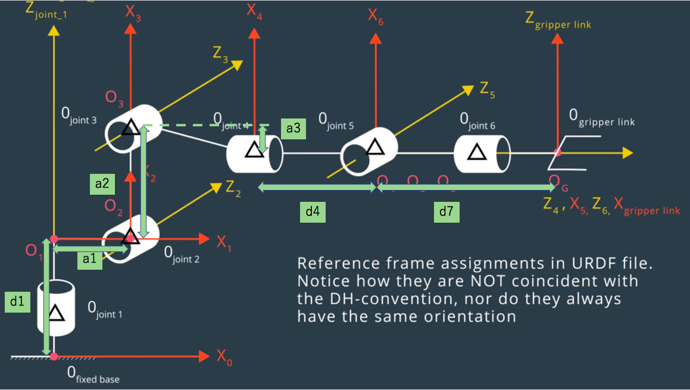

## Project: Kinematics Pick & Place
### Writeup Template: You can use this file as a template for your writeup if you want to submit it as a markdown file, but feel free to use some other method and submit a pdf if you prefer.

---


**Steps to complete the project:**  


1. Set up your ROS Workspace.
2. Download or clone the [project repository](https://github.com/udacity/RoboND-Kinematics-Project) into the ***src*** directory of your ROS Workspace.  
3. Experiment with the forward_kinematics environment and get familiar with the robot.
4. Launch in [demo mode](https://classroom.udacity.com/nanodegrees/nd209/parts/7b2fd2d7-e181-401e-977a-6158c77bf816/modules/8855de3f-2897-46c3-a805-628b5ecf045b/lessons/91d017b1-4493-4522-ad52-04a74a01094c/concepts/ae64bb91-e8c4-44c9-adbe-798e8f688193).
5. Perform Kinematic Analysis for the robot following the [project rubric](https://review.udacity.com/#!/rubrics/972/view).
6. Fill in the `IK_server.py` with your Inverse Kinematics code. 


[//]: # (Image References)

[image1]: ./misc_images/misc1.png
[image2]: ./misc_images/misc3.png
[image3]: ./misc_images/misc2.png

## [Rubric](https://review.udacity.com/#!/rubrics/972/view) Points
### Here I will consider the rubric points individually and describe how I addressed each point in my implementation.  

---
### Writeup / README

#### 1. Provide a Writeup / README that includes all the rubric points and how you addressed each one.  You can submit your writeup as markdown or pdf.  

You're reading it!

### Kinematic Analysis
#### 1. Run the forward_kinematics demo and evaluate the kr210.urdf.xacro file to perform kinematic analysis of Kuka KR210 robot and derive its DH parameters.

Here is an example of how to include an image in your writeup.

![alt text][image1]

#### 2. Using the DH parameter table you derived earlier, create individual transformation matrices about each joint. In addition, also generate a generalized homogeneous transform between base_link and gripper_link using only end-effector(gripper) pose.

FOllowing is the KR210 arm model to introduce DH parameters.



| Links | alpha(i-1) | a(i-1) | d(i-1) | theta(i)   |
| ----- | ---------- | ------ | ------ | ---------- |
| 0->1  | 0          | 0      | d0     | q0         |
| 1->2  | - pi/2     | a1     | 0      | -pi/2 + q1 |
| 2->3  | 0          | a2     | 0      | q2         |
| 3->4  | - pi/2     | a3     | d3     | q3         |
| 4->5  | pi/2       | 0      | 0      | q4         |
| 5->6  | - pi/2     | 0      | 0      | q5         |
| 6->EE | 0          | 0      | d6     | 0          |

```
        numofJoints = 7
        Q = [Symbol('q' + str(i)) for i in range(numofJoints)]
        D = [Symbol('d' + str(i)) for i in range(numofJoints)]
        A = [Symbol('a' + str(i)) for i in range(numofJoints)]
        ALPHA = [Symbol('alpha' + str(i)) for i in range(numofJoints)]
```

In this robot arm, Link 0 represents the base link, and
Link 7 represents the EE link, which is fixed.
Link 1 : d1 = 0.33(joint1.z) + 0.42(joint2.z) = 0.75
Link 2 : alpha1 = -pi/2 
a1 = 0.35(joint2.x) 
Link 3 : a2 = 1.25(joint3.z)
Link 4 : a3 = -0.054(joint4.z)
         d4 = 0.96(joint4.x) + 0.54(joint5.x) = 1.50
Link 7(Gripper Link) :, d6 = 0.193(joint6.x) + 0.11(gripper_joint.x)

Finally the DH paramter table is

| Links | alpha(i-1) | a(i-1)  | d(i-1) | theta(i)   |
| ----- | ---------- | ------- | ------ | ---------- |
| 0->1  |      0     | 0       | 0.75   | q1         |
| 1->2  | - pi/2     | 0.35    | 0      | -pi/2 + q2 |
| 2->3  |      0     | 1.25    | 0      | q3         |
| 3->4  | - pi/2     | -0.054  | 1.50   | q4         |
| 4->5  |   pi/2     | 0       | 0      | q5         |
| 5->6  | - pi/2     | 0       | 0      | q6         |
| 6->EE |      0     | 0       | 0.303  | 0          |

```
        a12 = 0.4500 # meters
        a23 = 0.3000 # meters

    	# Create Modified DH parameters
	    s = {alpha0: 0,  a0:   0, d1: 0,
             alpha1: 0,  a1: a12, d2: 0,
             alpha2: 0,  a2: a23,        q3: 0,
             alpha3: 0,  a3:   0, d4: 0}
```

#### 3. Decouple Inverse Kinematics problem into Inverse Position Kinematics and inverse Orientation Kinematics; doing so derive the equations to calculate all individual joint angles.

And here's where you can draw out and show your math for the derivation of your theta angles. 

![alt text][image2]

```
def T(alpha, a, q, d):
    mat =  Matrix([[            cos(q),           -sin(q),           0,             a],
                   [ sin(q)*cos(alpha), cos(q)*cos(alpha), -sin(alpha), -sin(alpha)*d],
                   [ sin(q)*sin(alpha), cos(q)*sin(alpha),  cos(alpha),  cos(alpha)*d],
                   [                 0,                 0,           0,             1]])

    return mat
```

### Project Implementation

#### 1. Fill in the `IK_server.py` file with properly commented python code for calculating Inverse Kinematics based on previously performed Kinematic Analysis. Your code must guide the robot to successfully complete 8/10 pick and place cycles. Briefly discuss the code you implemented and your results. 


Here I'll talk about the code, what techniques I used, what worked and why, where the implementation might fail and how I might improve it if I were going to pursue this project further.  


And just for fun, another example image:
![alt text][image3]


